# Food Delivery System

## Overview

An enterprise-grade food delivery platform built with **Java 21** and **Spring Boot 3**, following a feature-based
architecture grounded in **Domain-Driven Design (DDD)-Inspired Architecture**. The system supports three actors — *
*Customers**, **Restaurant Admins**, and **System Admins** — covering the full delivery lifecycle: user registration
with OTP-verified authentication, restaurant and menu management, cart operations, order placement via a Chain of
Responsibility pipeline, order tracking, customer account management, restaurant ratings, and a discovery layer powered
by PostgreSQL Full Text Search.

The codebase enforces strict architectural boundaries: rich domain entities manage their own state mutations, services
follow aggregate-root delegation patterns, and cross-cutting concerns (logging, security, exception handling) are
decoupled through AOP and Spring's filter chain. All integration tests run against a real PostgreSQL instance via
Singleton Testcontainers — no in-memory substitutes.

---

## Architecture & Design

### Tech Stack

| Layer        | Technology                                        |
|--------------|---------------------------------------------------|
| Language     | Java 21                                           |
| Framework    | Spring Boot 3, Spring Security 6, Spring Data JPA |
| Database     | PostgreSQL                                        |
| Architecture | Feature-based packaging with strict DDD           |

### Domain-Driven Design

Entities are **rich domain models** that encapsulate their own business logic and state mutations. For example, updating
a menu item calls `menuItem.applyModifications(name, description, price)` rather than exposing setters. Services are
layered following DDD aggregate boundaries:

```
RestaurantService (Aggregate Root)
  └── RestaurantMenuService
        └── MenuItemService
```

Every write operation enters through the aggregate root, which first validates the branch before delegating downstream.

### Design Patterns

| Pattern                               | Where & Why                                                                                                                                                                                          |
|---------------------------------------|------------------------------------------------------------------------------------------------------------------------------------------------------------------------------------------------------|
| **Chain of Responsibility**           | Order placement pipeline — five handlers (Cart Validation → Open Time Validation → Menu Item Validation → Order Finalization → Payment Processing) execute sequentially within a single transaction. |
| **AOP (Aspect-Oriented Programming)** | Centralized request/response/exception logging across all controllers and services, keeping business logic clean.                                                                                    |
| **Event-Driven**                      | Spring Application Events trigger asynchronous post-commit operations (e.g., order confirmation emails) without coupling the order transaction to email delivery.                                    |

---

## Security Model

### JWT Authentication

The system uses **stateless JWT-based authentication**. Every authenticated request carries a Bearer token in the
`Authorization` header. Tokens are validated by a custom `JwtAuthenticationFilter` in the Spring Security filter chain.
There are no server-side sessions.

### OTP Email Verification

Before a customer account becomes active, the user must verify their email through a **one-time password (OTP)** flow:

1. Customer registers → account created in a pending state.
2. System sends an OTP code to the registered email.
3. Customer submits the OTP via `/api/v1/public/auth/otp/verify`.
4. Upon successful verification, the account is activated and a JWT is issued.

### Role-Based Access Control

Two roles govern endpoint access:

- **`ROLE_CUSTOMER`** — Cart, order placement, addresses, ratings, account management.
- **`ROLE_ADMIN`** — Restaurant/branch/menu CRUD, order status management, admin creation.

Public endpoints (discovery, login, registration) require no authentication.

### Centralized Exception Handling

All application exceptions route through a **global `@RestControllerAdvice`** that returns a standardized JSON error
response. The security layer integrates tightly with this:

- A custom **`FilterChainExceptionHandler`** wraps the `JwtAuthenticationFilter` to catch token parsing/validation
  errors and forward them to the global handler.
- Spring Security's **`ExceptionTranslationFilter`** is explicitly mapped to the `HandlerExceptionResolver`, ensuring
  `401 Unauthorized` (missing/invalid tokens) and `403 Forbidden` (insufficient roles) responses flow through the same
  global handler — producing consistent error structures across the entire API.

### JPA Auditing

The `ApplicationAuditAware` bean is configured to extract the auditor's `UUID` by casting the `SecurityContext`
authentication to our custom `UserPrincipal` — avoiding `ClassCastException` issues that arise when Spring's default
auditing tries to cast JPA entity types.

---

## Implemented Features

### 1. Authentication & Authorization

Handles customer registration, admin creation, login, and OTP-based email verification. All authentication endpoints are
public and return JWT tokens upon successful login or verification.

- **Customer Registration** — Validates input (phone, email format, password 8–64 chars etc.), persists the customer,
  and triggers the OTP flow.
- **Admin Creation** — Restricted to existing admins. Supports assigning `ROLE_CUSTOMER`, `ROLE_ADMIN` currently
  hardcoded.
- **Login** — Authenticates via email/password and returns a signed JWT.
- **OTP Request & Verification** — Sends a 6-digit OTP to the user's email; verifies it to activate the account.

### 2. Restaurant & Branch Management

Admins can create, update, and delete restaurants and their branches. Each restaurant can have multiple branches, and
each branch operates independently with its own delivery fee, minimum order, operating hours, phone number, and
estimated delivery time.

- **Restaurant CRUD** — Name (2–100 chars), description (5–255 chars), and category associations.
- **Branch CRUD** — City, open/close times, delivery fee, minimum order, phone, estimated delivery time.
- **Branch Validation (Gatekeeper Pattern)** — Every menu or item operation first validates that the target branch
  exists and is enabled via an optimized `isEnabledById()` boolean query — not a full entity fetch.

### 3. Menu & Menu Item Management

Admins manage menus and menu items scoped to a specific restaurant branch. All operations follow the DDD delegation
chain: `RestaurantService → RestaurantMenuService → MenuItemService`. Menus and items support soft deletes via
Hibernate's `@SQLDelete`, and status toggling is idempotent — the service checks current state and returns early if
already in the desired state.

- **Menu CRUD** — Create, update (via `applyModifications()`), and soft-delete menus tied to a branch.
- **Menu Item CRUD** — Create, update, and soft-delete items within a menu. Items use static factory methods for
  construction.
- **Menu Status Toggle** — Enable/disable a menu via an idempotent `@Modifying` JPQL UPDATE query.
- **Public Access** — Customers can browse menus by branch and items by menu through unauthenticated public endpoints.
- **Menu Item Search** — Full Text Search powered by a PostgreSQL vector index with an optimized native query that
  filters first, then joins using PK indexes.

<details>
<summary><b>View Menu Item Management Diagrams</b></summary>

#### 3.1 Create Menu Item

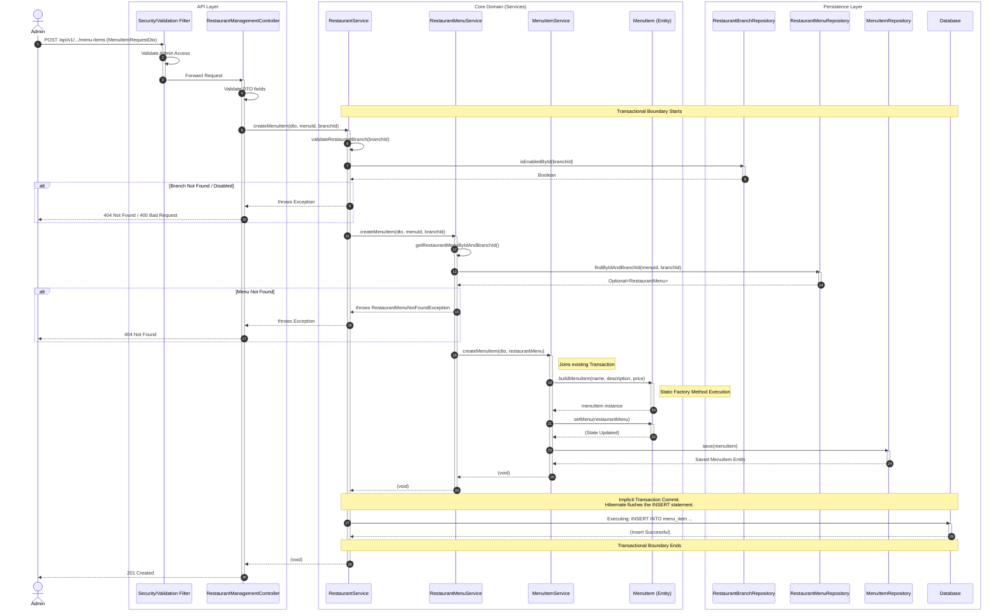
```mermaid
sequenceDiagram
    autonumber
    actor Admin

    box API Layer
        participant Filter as Security/Validation Filter
        participant Controller as RestaurantManagementController
    end

    box Core Domain (Services)
        participant RestService as RestaurantService
        participant MenuService as RestaurantMenuService
        participant ItemService as MenuItemService
        participant Entity as MenuItem (Entity)
    end

    box Persistence Layer
        participant BranchRepo as RestaurantBranchRepository
        participant MenuRepo as RestaurantMenuRepository
        participant ItemRepo as MenuItemRepository
        participant DB as Database
    end

%% 1. Request Initiation & Validation
    Admin ->> Filter: POST /api/v1/.../menu-items (MenuItemRequestDto)
    activate Filter
    Filter ->> Filter: Validate Admin Access
    Filter ->> Controller: Forward Request
    deactivate Filter
    activate Controller
    Controller ->> Controller: Validate DTO fields
%% 2. Aggregate Root Entry & Branch Validation
    Note over RestService, DB: Transactional Boundary Starts
    Controller ->> RestService: createMenuItem(dto, menuId, branchId)
    activate RestService
    RestService ->> RestService: validateRestaurantBranch(branchId)
    RestService ->> BranchRepo: isEnabledById(branchId)
    activate BranchRepo
    BranchRepo -->> RestService: Boolean
    deactivate BranchRepo

    alt Branch Not Found / Disabled
        RestService -->> Controller: throws Exception
        Controller -->> Admin: 404 Not Found / 400 Bad Request
    end

%% 3. Orchestration Menu Fetch & Validation
    RestService ->> MenuService: createMenuItem(dto, menuId, branchId)
    activate MenuService
    MenuService ->> MenuService: getRestaurantMenuByIdAndBranchId()
    MenuService ->> MenuRepo: findByIdAndBranchId(menuId, branchId)
    activate MenuRepo
    MenuRepo -->> MenuService: Optional<RestaurantMenu>
    deactivate MenuRepo

    alt Menu Not Found
        MenuService -->> RestService: throws RestaurantMenuNotFoundException
        RestService -->> Controller: throws Exception
        Controller -->> Admin: 404 Not Found
    end

%% 4. Item Creation & Entity Interaction
    MenuService ->> ItemService: createMenuItem(dto, restaurantMenu)
    activate ItemService
    Note right of ItemService: Joins existing Transaction
    ItemService ->> Entity: buildMenuItem(name, description, price)
    activate Entity
    Note right of Entity: Static Factory Method Execution
    Entity -->> ItemService: menuItem instance
    deactivate Entity
    ItemService ->> Entity: setMenu(restaurantMenu)
    activate Entity
    Entity -->> ItemService: (State Updated)
    deactivate Entity
    ItemService ->> ItemRepo: save(menuItem)
    activate ItemRepo
    ItemRepo -->> ItemService: Saved MenuItem Entity
    deactivate ItemRepo
%% 5. Return Flow & Transaction Commit
    ItemService -->> MenuService: (void)
    deactivate ItemService
    MenuService -->> RestService: (void)
    deactivate MenuService
    Note over RestService, DB: Implicit Transaction Commit.<br/>Hibernate flushes the INSERT statement.
    RestService ->> DB: Executing: INSERT INTO menu_item ...
    activate DB
    DB -->> RestService: (Insert Successful)
    deactivate DB
    Note over RestService, DB: Transactional Boundary Ends
    RestService -->> Controller: (void)
    deactivate RestService
    Controller -->> Admin: 201 Created
    deactivate Controller
```

#### 3.2 Update Menu Item

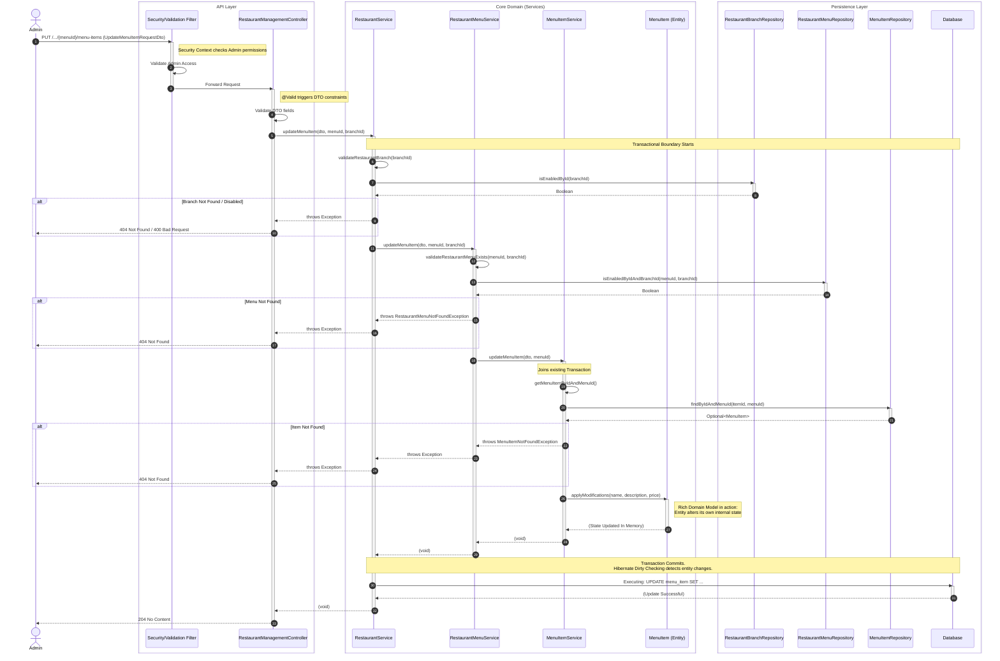
```mermaid
sequenceDiagram
    autonumber
    actor Admin

    box API Layer
        participant Filter as Security/Validation Filter
        participant Controller as RestaurantManagementController
    end

    box Core Domain (Services)
        participant RestService as RestaurantService
        participant MenuService as RestaurantMenuService
        participant ItemService as MenuItemService
        participant Entity as MenuItem (Entity)
    end

    box Persistence Layer
        participant BranchRepo as RestaurantBranchRepository
        participant MenuRepo as RestaurantMenuRepository
        participant ItemRepo as MenuItemRepository
        participant DB as Database
    end

%% 1. Request Initiation & Validation
    Admin ->> Filter: PUT /.../{menuId}/menu-items (UpdateMenuItemRequestDto)
    activate Filter
    Note right of Filter: Security Context checks Admin permissions
    Filter ->> Filter: Validate Admin Access
    Filter ->> Controller: Forward Request
    deactivate Filter
    activate Controller
    Note right of Controller: @Valid triggers DTO constraints
    Controller ->> Controller: Validate DTO fields
%% 2. Aggregate Root Entry & Branch Validation
    Controller ->> RestService: updateMenuItem(dto, menuId, branchId)
    activate RestService
    Note over RestService, DB: Transactional Boundary Starts
    RestService ->> RestService: validateRestaurantBranch(branchId)
    RestService ->> BranchRepo: isEnabledById(branchId)
    activate BranchRepo
    BranchRepo -->> RestService: Boolean
    deactivate BranchRepo

    alt Branch Not Found / Disabled
        RestService -->> Controller: throws Exception
        Controller -->> Admin: 404 Not Found / 400 Bad Request
    end

%% 3. Menu Fetch & Ownership Validation
    RestService ->> MenuService: updateMenuItem(dto, menuId, branchId)
    activate MenuService
    MenuService ->> MenuService: validateRestaurantMenuExists(menuId, branchId)
    MenuService ->> MenuRepo: isEnabledByIdAndBranchId(menuId, branchId)
    activate MenuRepo
    MenuRepo -->> MenuService: Boolean
    deactivate MenuRepo

    alt Menu Not Found
        MenuService -->> RestService: throws RestaurantMenuNotFoundException
        RestService -->> Controller: throws Exception
        Controller -->> Admin: 404 Not Found
    end

%% 4. Item Fetch & Verification
    MenuService ->> ItemService: updateMenuItem(dto, menuId)
    activate ItemService
    Note over ItemService: Joins existing Transaction
    ItemService ->> ItemService: getMenuItemByIdAndMenuId()
    ItemService ->> ItemRepo: findByIdAndMenuId(itemId, menuId)
    activate ItemRepo
    ItemRepo -->> ItemService: Optional<MenuItem>
    deactivate ItemRepo

    alt Item Not Found
        ItemService -->> MenuService: throws MenuItemNotFoundException
        MenuService -->> RestService: throws Exception
        RestService -->> Controller: throws Exception
        Controller -->> Admin: 404 Not Found
    end

%% 5. Entity State Mutation (DDD)
    ItemService ->> Entity: applyModifications(name, description, price)
    activate Entity
    Note right of Entity: Rich Domain Model in action:<br/>Entity alters its own internal state
    Entity -->> ItemService: (State Updated In Memory)
    deactivate Entity
%% 6. Return Flow & Implicit Database Sync
    ItemService -->> MenuService: (void)
    deactivate ItemService
    MenuService -->> RestService: (void)
    deactivate MenuService
    Note over RestService, DB: Transaction Commits.<br/>Hibernate Dirty Checking detects entity changes.
    RestService ->> DB: Executing: UPDATE menu_item SET ...
    activate DB
    DB -->> RestService: (Update Successful)
    deactivate DB
    RestService -->> Controller: (void)
    deactivate RestService
    Controller -->> Admin: 204 No Content
    deactivate Controller
```

#### 3.3 Delete Menu Item

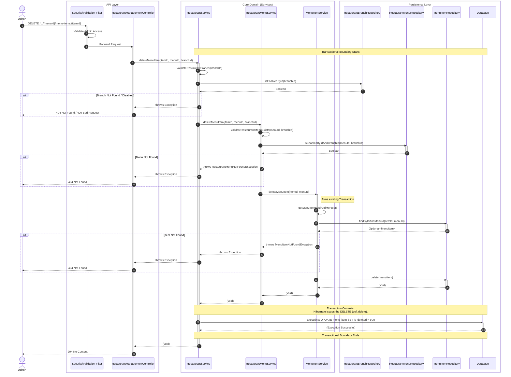
```mermaid
sequenceDiagram
    autonumber
    actor Admin

    box API Layer
        participant Filter as Security/Validation Filter
        participant Controller as RestaurantManagementController
    end

    box Core Domain (Services)
        participant RestService as RestaurantService
        participant MenuService as RestaurantMenuService
        participant ItemService as MenuItemService
    end

    box Persistence Layer
        participant BranchRepo as RestaurantBranchRepository
        participant MenuRepo as RestaurantMenuRepository
        participant ItemRepo as MenuItemRepository
        participant DB as Database
    end

%% 1. Request Initiation & Validation
    Admin ->> Filter: DELETE /.../{menuId}/menu-items/{itemId}
    activate Filter
    Filter ->> Filter: Validate Admin Access
    Filter ->> Controller: Forward Request
    deactivate Filter
    activate Controller
%% 2. Aggregate Root Entry & Branch Validation
    Note over RestService, DB: Transactional Boundary Starts
    Controller ->> RestService: deleteMenuItem(itemId, menuId, branchId)
    activate RestService
    RestService ->> RestService: validateRestaurantBranch(branchId)
    RestService ->> BranchRepo: isEnabledById(branchId)
    activate BranchRepo
    BranchRepo -->> RestService: Boolean
    deactivate BranchRepo

    alt Branch Not Found / Disabled
        RestService -->> Controller: throws Exception
        Controller -->> Admin: 404 Not Found / 400 Bad Request
    end

%% 3. Menu Fetch & Validation
    RestService ->> MenuService: deleteMenuItem(itemId, menuId, branchId)
    activate MenuService
    MenuService ->> MenuService: validateRestaurantMenuExists(menuId, branchId)
    MenuService ->> MenuRepo: isEnabledByIdAndBranchId(menuId, branchId)
    activate MenuRepo
    MenuRepo -->> MenuService: Boolean
    deactivate MenuRepo

    alt Menu Not Found
        MenuService -->> RestService: throws RestaurantMenuNotFoundException
        RestService -->> Controller: throws Exception
        Controller -->> Admin: 404 Not Found
    end

%% 4. Item Fetch & Deletion
    MenuService ->> ItemService: deleteMenuItem(itemId, menuId)
    activate ItemService
    Note right of ItemService: Joins existing Transaction
    ItemService ->> ItemService: getMenuItemByIdAndMenuId()
    ItemService ->> ItemRepo: findByIdAndMenuId(itemId, menuId)
    activate ItemRepo
    ItemRepo -->> ItemService: Optional<MenuItem>
    deactivate ItemRepo

    alt Item Not Found
        ItemService -->> MenuService: throws MenuItemNotFoundException
        MenuService -->> RestService: throws Exception
        RestService -->> Controller: throws Exception
        Controller -->> Admin: 404 Not Found
    end

    ItemService ->> ItemRepo: delete(menuItem)
    activate ItemRepo
    ItemRepo -->> ItemService: (void)
    deactivate ItemRepo
%% 5. Return Flow & Transaction Commit
    ItemService -->> MenuService: (void)
    deactivate ItemService
    MenuService -->> RestService: (void)
    deactivate MenuService
    Note over RestService, DB: Transaction Commits.<br/>Hibernate issues the DELETE (soft delete).
    RestService ->> DB: Executing: UPDATE menu_item SET is_deleted = true
    activate DB
    DB -->> RestService: (Execution Successful)
    deactivate DB
    Note over RestService, DB: Transactional Boundary Ends
    RestService -->> Controller: (void)
    deactivate RestService
    Controller -->> Admin: 204 No Content
    deactivate Controller
```

#### 3.4 Get All Menu Items by Menu ID

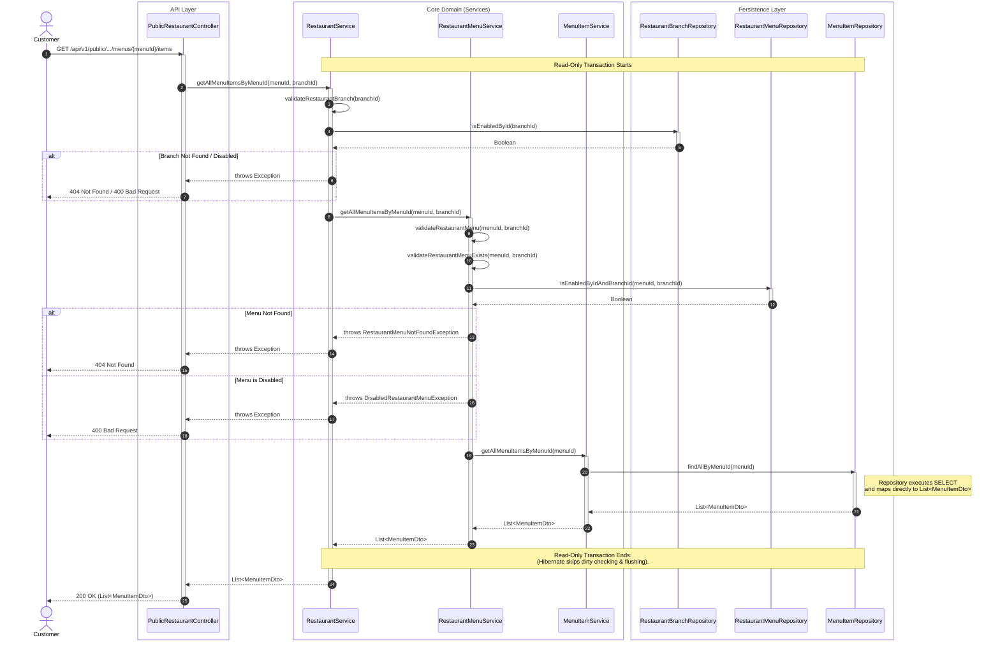
```mermaid
sequenceDiagram
    autonumber
    actor Customer

    box API Layer
        participant Controller as PublicRestaurantController
    end

    box Core Domain (Services)
        participant RestService as RestaurantService
        participant MenuService as RestaurantMenuService
        participant ItemService as MenuItemService
    end

    box Persistence Layer
        participant BranchRepo as RestaurantBranchRepository
        participant MenuRepo as RestaurantMenuRepository
        participant ItemRepo as MenuItemRepository
    end

%% 1. Request Initiation
    Customer ->> Controller: GET /api/v1/public/.../menus/{menuId}/items
    activate Controller
%% 2. Aggregate Root Entry & Branch Validation
    Note over RestService, ItemRepo: Read-Only Transaction Starts
    Controller ->> RestService: getAllMenuItemsByMenuId(menuId, branchId)
    activate RestService
    RestService ->> RestService: validateRestaurantBranch(branchId)
    RestService ->> BranchRepo: isEnabledById(branchId)
    activate BranchRepo
    BranchRepo -->> RestService: Boolean
    deactivate BranchRepo

    alt Branch Not Found / Disabled
        RestService -->> Controller: throws Exception
        Controller -->> Customer: 404 Not Found / 400 Bad Request
    end

%% 3. Menu Validation
    RestService ->> MenuService: getAllMenuItemsByMenuId(menuId, branchId)
    activate MenuService
    MenuService ->> MenuService: validateRestaurantMenu(menuId, branchId)
    MenuService ->> MenuService: validateRestaurantMenuExists(menuId, branchId)
    MenuService ->> MenuRepo: isEnabledByIdAndBranchId(menuId, branchId)
    activate MenuRepo
    MenuRepo -->> MenuService: Boolean
    deactivate MenuRepo

    alt Menu Not Found
        MenuService -->> RestService: throws RestaurantMenuNotFoundException
        RestService -->> Controller: throws Exception
        Controller -->> Customer: 404 Not Found
    else Menu is Disabled
        MenuService -->> RestService: throws DisabledRestaurantMenuException
        RestService -->> Controller: throws Exception
        Controller -->> Customer: 400 Bad Request
    end

%% 4. Delegating to Child Service
    MenuService ->> ItemService: getAllMenuItemsByMenuId(menuId)
    activate ItemService
%% 5. Database Fetch & DTO Projection
    ItemService ->> ItemRepo: findAllByMenuId(menuId)
    activate ItemRepo
    Note right of ItemRepo: Repository executes SELECT<br/>and maps directly to List<MenuItemDto>
    ItemRepo -->> ItemService: List<MenuItemDto>
    deactivate ItemRepo
%% 6. Return Flow & Tx Closure
    ItemService -->> MenuService: List<MenuItemDto>
    deactivate ItemService
    MenuService -->> RestService: List<MenuItemDto>
    deactivate MenuService
    Note over RestService, ItemRepo: Read-Only Transaction Ends.<br/>(Hibernate skips dirty checking & flushing).
    RestService -->> Controller: List<MenuItemDto>
    deactivate RestService
    Controller -->> Customer: 200 OK (List<MenuItemDto>)
    deactivate Controller
```

#### 3.5 Search Menu Items

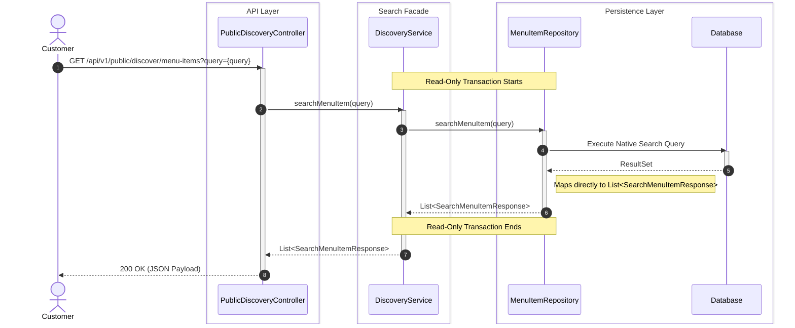
```mermaid
sequenceDiagram
    autonumber
    actor Customer

    box API Layer
        participant Controller as PublicDiscoveryController
    end

    box Search Facade
        participant Discovery as DiscoveryService
    end

    box Persistence Layer
        participant Repo as MenuItemRepository
        participant DB as Database
    end

    Customer ->> Controller: GET /api/v1/public/discover/menu-items?query={query}
    activate Controller
    Note over Discovery, Repo: Read-Only Transaction Starts
    Controller ->> Discovery: searchMenuItem(query)
    activate Discovery
    Discovery ->> Repo: searchMenuItem(query)
    activate Repo
    Repo ->> DB: Execute Native Search Query
    activate DB
    DB -->> Repo: ResultSet
    deactivate DB
    Note right of Repo: Maps directly to List<SearchMenuItemResponse>
    Repo -->> Discovery: List<SearchMenuItemResponse>
    deactivate Repo
    Note over Discovery, Repo: Read-Only Transaction Ends
    Discovery -->> Controller: List<SearchMenuItemResponse>
    deactivate Discovery
    Controller -->> Customer: 200 OK (JSON Payload)
    deactivate Controller
```

> **Design Decision:** The Discovery service interacts directly with the repository — bypassing the aggregate-root
> delegation chain. Public search operations require no aggregate protection, business rule enforcement, or
> transactional
> orchestration, so the DDD overhead is intentionally skipped. Interface-based projections retrieve only the required
> fields, eliminating over-fetching and in-app mapping.
</details>

<details>
<summary><b>View Menu Management Diagrams</b></summary>

#### 3.6 Create Menu

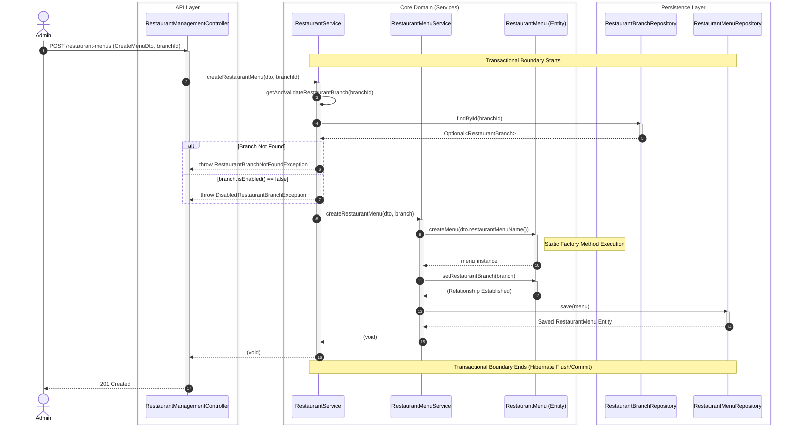
```mermaid
sequenceDiagram
    autonumber
    actor Admin

    box API Layer
        participant Controller as RestaurantManagementController
    end

    box Core Domain (Services)
        participant RestService as RestaurantService
        participant MenuService as RestaurantMenuService
        participant Entity as RestaurantMenu (Entity)
    end

    box Persistence Layer
        participant BranchRepo as RestaurantBranchRepository
        participant MenuRepo as RestaurantMenuRepository
    end

    Admin ->> Controller: POST /restaurant-menus (CreateMenuDto, branchId)
    activate Controller
    Note over RestService, MenuRepo: Transactional Boundary Starts
    Controller ->> RestService: createRestaurantMenu(dto, branchId)
    activate RestService
%% Branch Fetch and Validation
    RestService ->> RestService: getAndValidateRestaurantBranch(branchId)
    RestService ->> BranchRepo: findById(branchId)
    activate BranchRepo
    BranchRepo -->> RestService: Optional<RestaurantBranch>
    deactivate BranchRepo

    alt Branch Not Found
        RestService -->> Controller: throw RestaurantBranchNotFoundException
    else branch.isEnabled() == false
        RestService -->> Controller: throw DisabledRestaurantBranchException
    end

%% Menu Creation Delegation
    RestService ->> MenuService: createRestaurantMenu(dto, branch)
    activate MenuService
%% Rich Domain Entity Initialization
    MenuService ->> Entity: createMenu(dto.restaurantMenuName())
    activate Entity
    Note right of Entity: Static Factory Method Execution
    Entity -->> MenuService: menu instance
    deactivate Entity
%% JPA Association
    MenuService ->> Entity: setRestaurantBranch(branch)
    activate Entity
    Entity -->> MenuService: (Relationship Established)
    deactivate Entity
%% Persistence
    MenuService ->> MenuRepo: save(menu)
    activate MenuRepo
    MenuRepo -->> MenuService: Saved RestaurantMenu Entity
    deactivate MenuRepo
%% Return Flow
    MenuService -->> RestService: (void)
    deactivate MenuService
    RestService -->> Controller: (void)
    deactivate RestService
    Note over RestService, MenuRepo: Transactional Boundary Ends (Hibernate Flush/Commit)
    Controller -->> Admin: 201 Created
    deactivate Controller
```

#### 3.7 Update Menu

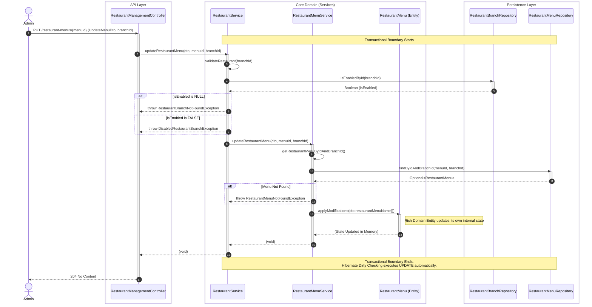
```mermaid
sequenceDiagram
    autonumber
    actor Admin

    box API Layer
        participant Controller as RestaurantManagementController
    end

    box Core Domain (Services)
        participant RestService as RestaurantService
        participant MenuService as RestaurantMenuService
        participant Entity as RestaurantMenu (Entity)
    end

    box Persistence Layer
        participant BranchRepo as RestaurantBranchRepository
        participant MenuRepo as RestaurantMenuRepository
    end

    Admin ->> Controller: PUT /restaurant-menus/{menuId} (UpdateMenuDto, branchId)
    activate Controller
    Note over RestService, MenuRepo: Transactional Boundary Starts
    Controller ->> RestService: updateRestaurantMenu(dto, menuId, branchId)
    activate RestService
%% Branch Validation (Optimized Boolean Check)
    RestService ->> RestService: validateRestaurant(branchId)
    RestService ->> BranchRepo: isEnabledById(branchId)
    activate BranchRepo
    BranchRepo -->> RestService: Boolean (isEnabled)
    deactivate BranchRepo

    alt isEnabled is NULL
        RestService -->> Controller: throw RestaurantBranchNotFoundException
    else isEnabled is FALSE
        RestService -->> Controller: throw DisabledRestaurantBranchException
    end

%% Delegation to Menu Service
    RestService ->> MenuService: updateRestaurantMenu(dto, menuId, branchId)
    activate MenuService
%% Menu Entity Fetch
    MenuService ->> MenuService: getRestaurantMenuByIdAndBranchId()
    MenuService ->> MenuRepo: findByIdAndBranchId(menuId, branchId)
    activate MenuRepo
    MenuRepo -->> MenuService: Optional<RestaurantMenu>
    deactivate MenuRepo

    alt Menu Not Found
        MenuService -->> RestService: throw RestaurantMenuNotFoundException
    end

%% State Mutation (Rich Domain Model)
    MenuService ->> Entity: applyModifications(dto.restaurantMenuName())
    activate Entity
    Note right of Entity: Rich Domain Entity updates its own internal state
    Entity -->> MenuService: (State Updated in Memory)
    deactivate Entity
%% Return Flow
    MenuService -->> RestService: (void)
    deactivate MenuService
    RestService -->> Controller: (void)
    deactivate RestService
    Note over RestService, MenuRepo: Transactional Boundary Ends.<br/>Hibernate Dirty Checking executes UPDATE automatically.
    Controller -->> Admin: 204 No Content
    deactivate Controller
```

#### 3.8 Delete Menu

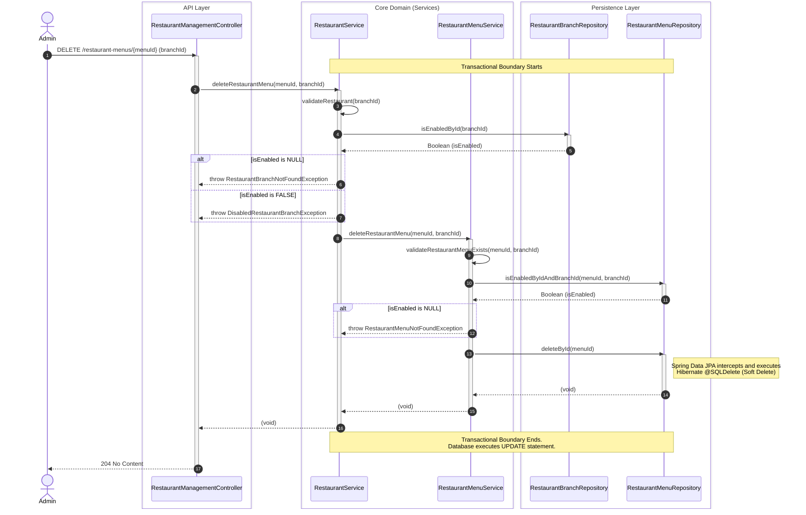
```mermaid
sequenceDiagram
    autonumber
    actor Admin

    box API Layer
        participant Controller as RestaurantManagementController
    end

    box Core Domain (Services)
        participant RestService as RestaurantService
        participant MenuService as RestaurantMenuService
    end

    box Persistence Layer
        participant BranchRepo as RestaurantBranchRepository
        participant MenuRepo as RestaurantMenuRepository
    end

    Admin ->> Controller: DELETE /restaurant-menus/{menuId} (branchId)
    activate Controller
    Note over RestService, MenuRepo: Transactional Boundary Starts
    Controller ->> RestService: deleteRestaurantMenu(menuId, branchId)
    activate RestService
%% Branch Validation (Optimized Boolean Check)
    RestService ->> RestService: validateRestaurant(branchId)
    RestService ->> BranchRepo: isEnabledById(branchId)
    activate BranchRepo
    BranchRepo -->> RestService: Boolean (isEnabled)
    deactivate BranchRepo

    alt isEnabled is NULL
        RestService -->> Controller: throw RestaurantBranchNotFoundException
    else isEnabled is FALSE
        RestService -->> Controller: throw DisabledRestaurantBranchException
    end

%% Delegation to Menu Service
    RestService ->> MenuService: deleteRestaurantMenu(menuId, branchId)
    activate MenuService
%% Menu Validation (Optimized Boolean Check)
    MenuService ->> MenuService: validateRestaurantMenuExists(menuId, branchId)
    MenuService ->> MenuRepo: isEnabledByIdAndBranchId(menuId, branchId)
    activate MenuRepo
    MenuRepo -->> MenuService: Boolean (isEnabled)
    deactivate MenuRepo

    alt isEnabled is NULL
        MenuService -->> RestService: throw RestaurantMenuNotFoundException
    end

%% Deletion Execution
    MenuService ->> MenuRepo: deleteById(menuId)
    activate MenuRepo
    Note right of MenuRepo: Spring Data JPA intercepts and executes<br/>Hibernate @SQLDelete (Soft Delete)
    MenuRepo -->> MenuService: (void)
    deactivate MenuRepo
%% Return Flow
    MenuService -->> RestService: (void)
    deactivate MenuService
    RestService -->> Controller: (void)
    deactivate RestService
    Note over RestService, MenuRepo: Transactional Boundary Ends.<br/>Database executes UPDATE statement.
    Controller -->> Admin: 204 No Content
    deactivate Controller
```

#### 3.9 Toggle Menu Status (Enable / Disable)

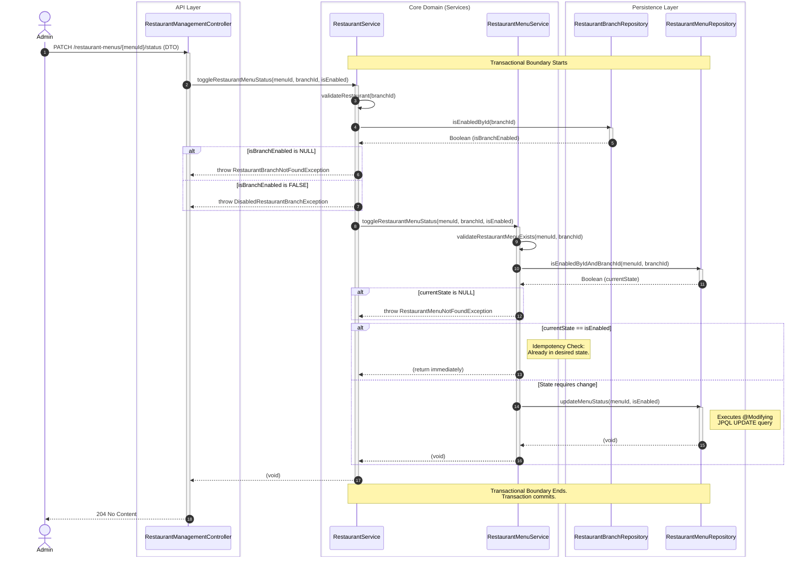
```mermaid
sequenceDiagram
    autonumber
    actor Admin

    box API Layer
        participant Controller as RestaurantManagementController
    end

    box Core Domain (Services)
        participant RestService as RestaurantService
        participant MenuService as RestaurantMenuService
    end

    box Persistence Layer
        participant BranchRepo as RestaurantBranchRepository
        participant MenuRepo as RestaurantMenuRepository
    end

    Admin ->> Controller: PATCH /restaurant-menus/{menuId}/status (DTO)
    activate Controller
    Note over RestService, MenuRepo: Transactional Boundary Starts
    Controller ->> RestService: toggleRestaurantMenuStatus(menuId, branchId, isEnabled)
    activate RestService
%% Branch Validation (Gatekeeper Pattern)
    RestService ->> RestService: validateRestaurant(branchId)
    RestService ->> BranchRepo: isEnabledById(branchId)
    activate BranchRepo
    BranchRepo -->> RestService: Boolean (isBranchEnabled)
    deactivate BranchRepo

    alt isBranchEnabled is NULL
        RestService -->> Controller: throw RestaurantBranchNotFoundException
    else isBranchEnabled is FALSE
        RestService -->> Controller: throw DisabledRestaurantBranchException
    end

%% Delegation to Menu Service
    RestService ->> MenuService: toggleRestaurantMenuStatus(menuId, branchId, isEnabled)
    activate MenuService
%% Menu Validation & State Retrieval
    MenuService ->> MenuService: validateRestaurantMenuExists(menuId, branchId)
    MenuService ->> MenuRepo: isEnabledByIdAndBranchId(menuId, branchId)
    activate MenuRepo
    MenuRepo -->> MenuService: Boolean (currentState)
    deactivate MenuRepo

    alt currentState is NULL
        MenuService -->> RestService: throw RestaurantMenuNotFoundException
    end

%% Idempotency Check & Update
    alt currentState == isEnabled
        Note right of MenuService: Idempotency Check:<br/>Already in desired state.
        MenuService -->> RestService: (return immediately)
    else State requires change
        MenuService ->> MenuRepo: updateMenuStatus(menuId, isEnabled)
        activate MenuRepo
        Note right of MenuRepo: Executes @Modifying<br/>JPQL UPDATE query
        MenuRepo -->> MenuService: (void)
        deactivate MenuRepo
        MenuService -->> RestService: (void)
    end
    deactivate MenuService
    RestService -->> Controller: (void)
    deactivate RestService
    Note over RestService, MenuRepo: Transactional Boundary Ends.<br/>Transaction commits.
    Controller -->> Admin: 204 No Content
    deactivate Controller
```

#### 3.10 Get All Menus by Branch ID

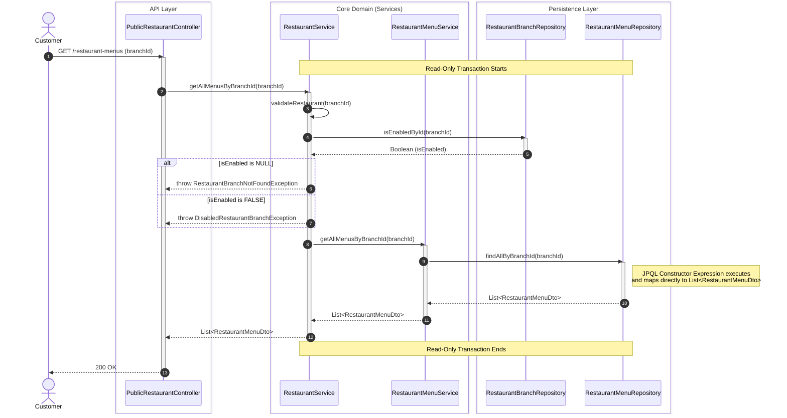
```mermaid
sequenceDiagram
    autonumber
    actor Customer

    box API Layer
        participant Controller as PublicRestaurantController
    end

    box Core Domain (Services)
        participant RestService as RestaurantService
        participant MenuService as RestaurantMenuService
    end

    box Persistence Layer
        participant BranchRepo as RestaurantBranchRepository
        participant MenuRepo as RestaurantMenuRepository
    end

    Customer ->> Controller: GET /restaurant-menus (branchId)
    activate Controller
    Note over RestService, MenuRepo: Read-Only Transaction Starts
    Controller ->> RestService: getAllMenusByBranchId(branchId)
    activate RestService
%% Branch Validation (Optimized Boolean Check)
    RestService ->> RestService: validateRestaurant(branchId)
    RestService ->> BranchRepo: isEnabledById(branchId)
    activate BranchRepo
    BranchRepo -->> RestService: Boolean (isEnabled)
    deactivate BranchRepo

    alt isEnabled is NULL
        RestService -->> Controller: throw RestaurantBranchNotFoundException
    else isEnabled is FALSE
        RestService -->> Controller: throw DisabledRestaurantBranchException
    end

%% Delegation to Menu Service
    RestService ->> MenuService: getAllMenusByBranchId(branchId)
    activate MenuService
%% Optimized Database Fetch (DTO Projection)
    MenuService ->> MenuRepo: findAllByBranchId(branchId)
    activate MenuRepo
    Note right of MenuRepo: JPQL Constructor Expression executes<br/>and maps directly to List<RestaurantMenuDto>
    MenuRepo -->> MenuService: List<RestaurantMenuDto>
    deactivate MenuRepo
%% Return Flow
    MenuService -->> RestService: List<RestaurantMenuDto>
    deactivate MenuService
    RestService -->> Controller: List<RestaurantMenuDto>
    deactivate RestService
    Note over RestService, MenuRepo: Read-Only Transaction Ends
    Controller -->> Customer: 200 OK
    deactivate Controller
```

</details>

---

### 4. Cart Management

Manages the customer's shopping cart with strict business rules: all items in a cart must belong to the same restaurant
branch, adding a duplicate item increments its quantity instead of creating a duplicate entry, and decreasing quantity
to zero automatically removes the item.

- **Add to Cart** — Validates restaurant consistency, item availability, and handles duplicate detection.
- **Modify Cart Item** — Updates quantity and/or note for an existing cart item.
- **Remove Cart Item** — Removes a specific item and recalculates the cart total.
- **Clear Cart** — Removes all items from the cart.
- **View Cart** — Returns all cart items with individual subtotals and the cart total.

<details>
<summary><b>View Cart Management Diagrams</b></summary>

#### 4.1 Add to Cart

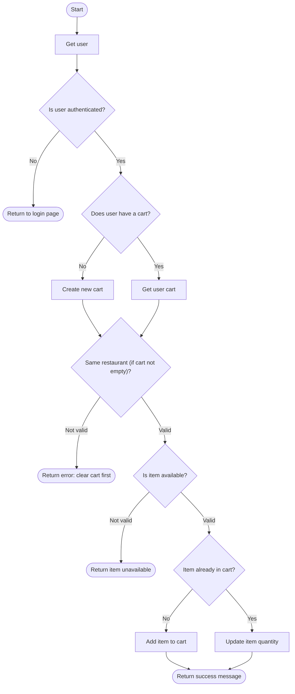
```mermaid
flowchart TB
    n1([Start]) --> n2["Get user"]
    n2 --> n12{"Is user authenticated?"}
    n12 -- No --> n13([Return to login page])
    n12 -- Yes --> n3{"Does user have a cart?"}
    n3 -- No --> n10["Create new cart"]
    n3 -- Yes --> n11["Get user cart"]
    n10 --> n5
    n11 --> n5
    n5{"Same restaurant (if cart not empty)?"}
    n5 -- Not valid --> n6([Return error: clear cart first])
    n5 -- Valid --> n7{"Is item available?"}
    n7 -- Not valid --> n8([Return item unavailable])
    n7 -- Valid --> n9{"Item already in cart?"}
    n9 -- No --> n14["Add item to cart"]
    n9 -- Yes --> n15["Update item quantity"]
    n14 --> n16([Return success message])
    n15 --> n16
```

#### 4.2 Increase Item Quantity

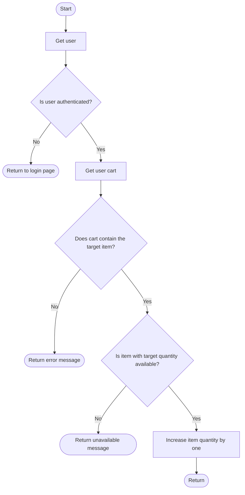
```mermaid
flowchart TB
    n1([Start]) --> n2["Get user"]
    n2 --> n3{"Is user authenticated?"}
    n3 -- No --> n4([Return to login page])
    n3 -- Yes --> n5["Get user cart"]
    n5 --> n6{"Does cart contain the target item?"}
    n6 -- No --> n7([Return error message])
    n6 -- Yes --> n8{"Is item with target quantity available?"}
    n8 -- No --> n9([Return unavailable message])
    n8 -- Yes --> n10["Increase item quantity by one"]
    n10 --> n11([Return])
```

#### 4.3 Decrease Item Quantity

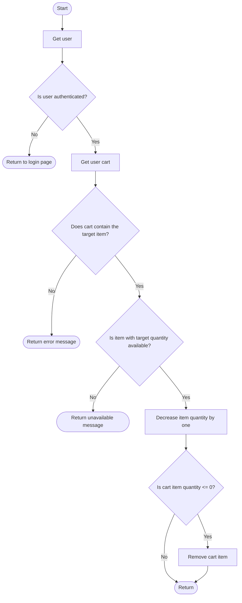
```mermaid
flowchart TB
    n1([Start]) --> n2["Get user"]
    n2 --> n3{"Is user authenticated?"}
    n3 -- No --> n4([Return to login page])
    n3 -- Yes --> n5["Get user cart"]
    n5 --> n6{"Does cart contain the target item?"}
    n6 -- No --> n7([Return error message])
    n6 -- Yes --> n8{"Is item with target quantity available?"}
    n8 -- No --> n9([Return unavailable message])
    n8 -- Yes --> n10["Decrease item quantity by one"]
    n10 --> n12{"Is cart item quantity <= 0?"}
    n12 -- No --> n13([Return])
    n12 -- Yes --> n14["Remove cart item"]
    n14 --> n13
```

#### 4.4 View Cart

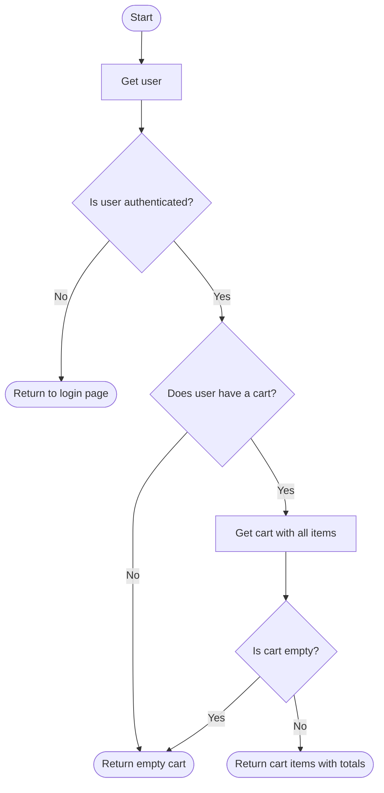
```mermaid
flowchart TB
    n1([Start]) --> n2["Get user"]
    n2 --> n3{"Is user authenticated?"}
    n3 -- No --> n4([Return to login page])
    n3 -- Yes --> n5{"Does user have a cart?"}
    n5 -- No --> n6([Return empty cart])
    n5 -- Yes --> n7["Get cart with all items"]
    n7 --> n8{"Is cart empty?"}
    n8 -- Yes --> n6
    n8 -- No --> n9([Return cart items with totals])
```

#### 4.5 Clear All Items

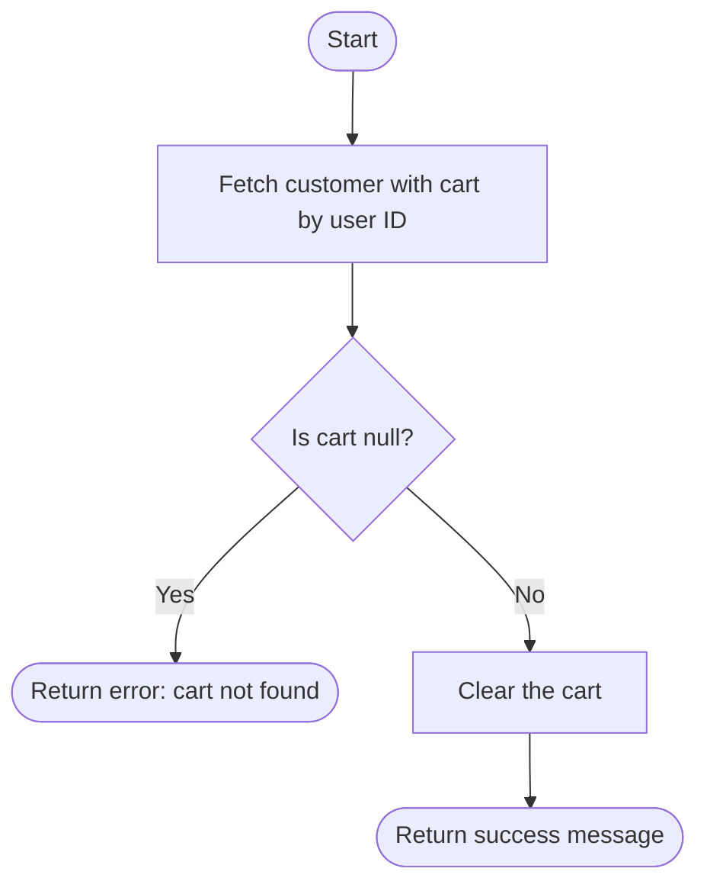
```mermaid
flowchart TB
    n1([Start]) --> n2["Fetch customer with cart by user ID"]
    n2 --> n3{"Is cart null?"}
    n3 -- Yes --> n4([Return error: cart not found])
    n3 -- No --> n5["Clear the cart"]
    n5 --> n6([Return success message])
```

#### 4.6 Remove Item

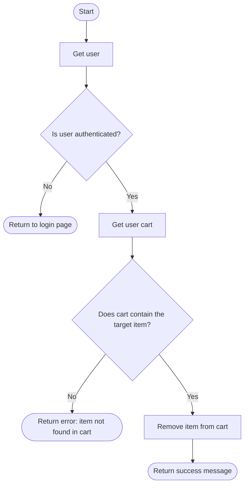
```mermaid
flowchart TB
    n1([Start]) --> n2["Get user"]
    n2 --> n3{"Is user authenticated?"}
    n3 -- No --> n4([Return to login page])
    n3 -- Yes --> n5["Get user cart"]
    n5 --> n6{"Does cart contain the target item?"}
    n6 -- No --> n7([Return error: item not found in cart])
    n6 -- Yes --> n8["Remove item from cart"]
    n8 --> n9([Return success message])

```

</details>

---

### 5. Order Management

Handles the full order lifecycle from placement through delivery or cancellation. Orders follow a strict state machine,
and placement is orchestrated through a **Chain of Responsibility** pipeline that validates, finalizes, and processes
payment within a single transaction. Order status updates trigger asynchronous email notifications via Spring
Application Events.

- **Place Order** — Executes a 5-handler Chain of Responsibility pipeline (see diagram below).
- **Order Details & History** — Customers can view individual order details or browse paginated order history filtered
  by status.
- **Order Tracking** — Full tracking history with timestamped status transitions.
- **Status Advancement** — Admins advance orders through the state machine (
  `PENDING → IN_PROGRESS → ON_THE_WAY → DELIVERED`).
- **Order Cancellation** — Admins can cancel orders from any state (including `DELIVERED` as a refund).

<details>
<summary><b>View Order Management Diagrams</b></summary>

#### 5.1 Order State Machine

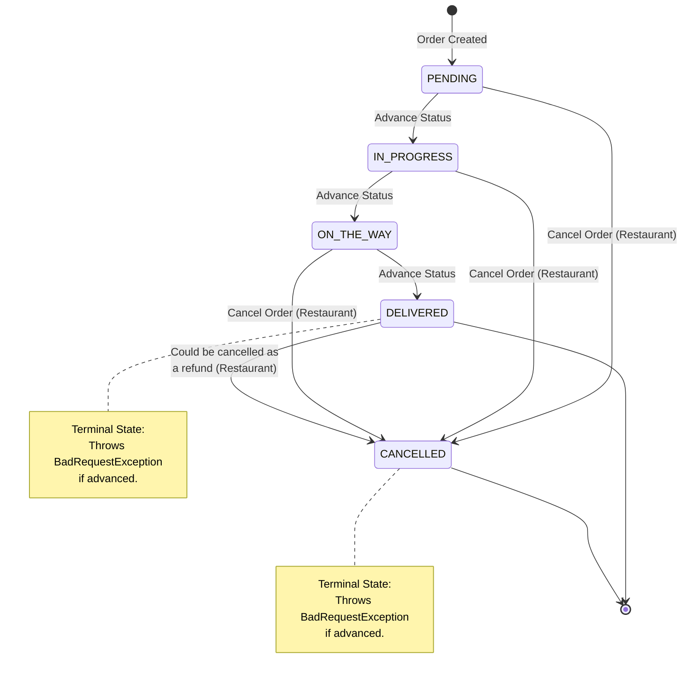
```mermaid

stateDiagram-v2
    direction TB
    [*] --> PENDING: Order Created
    PENDING --> IN_PROGRESS: Advance Status
    IN_PROGRESS --> ON_THE_WAY: Advance Status
    ON_THE_WAY --> DELIVERED: Advance Status
    PENDING --> CANCELLED: Cancel Order (Restaurant)
    IN_PROGRESS --> CANCELLED: Cancel Order (Restaurant)
    ON_THE_WAY --> CANCELLED: Cancel Order (Restaurant)
    DELIVERED --> CANCELLED: Could be cancelled as <br>a refund (Restaurant)
    note right of DELIVERED
        Terminal State:
        Throws BadRequestException
        if advanced.
    end note
    note right of CANCELLED
        Terminal State:
        Throws BadRequestException
        if advanced.
    end note
    DELIVERED --> [*]
    CANCELLED --> [*]
```

#### 5.2 Update Order Status

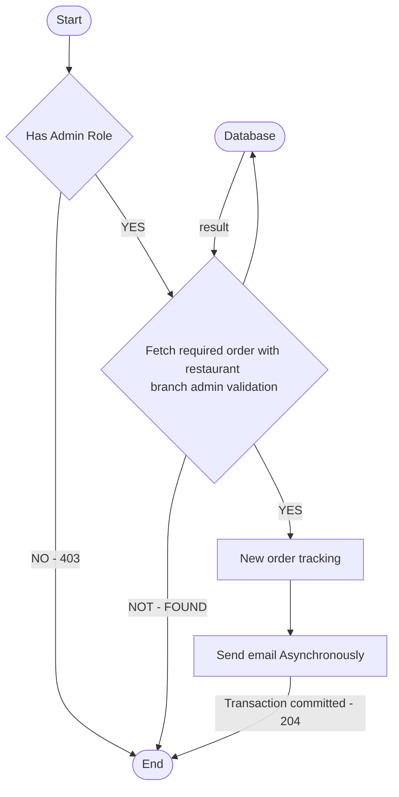
```mermaid
flowchart TB
    db([Database])
    start(["Start"]) --> auth{"Has Admin Role"}
    auth -- YES --> update{"Fetch required order with restaurant <br>branch admin validation"}
    update --> db
    db -- result --> update
    auth -- " NO - 403 " ----> en
    update -- " NOT - FOUND " --> en(["End"])
    update -- YES --> tracking["New order tracking"]
    tracking --> mail["Send email Asynchronously"]
    mail -- " Transaction committed - 204 " --> en


```

#### 5.3 Place Order — Chain of Responsibility Pipeline

The order placement is the most complex transactional workflow in the system. Instead of a monolithic service method, it
uses a **Chain of Responsibility** pattern where five handlers execute sequentially, each performing a specific
validation or action step. All handlers share an `OrderProcessingContext` object and participate in the same
`@Transactional` boundary.

**Pipeline Stages:**

1. **CartValidation** — Fetches the cart with a pessimistic lock, validates restaurant branch match.
2. **OpenTimeValidation** — Validates the restaurant branch is currently open.
3. **MenuItemValidation** — Fetches cart items with `JOIN FETCH`, validates item availability.
4. **FinalizeOrder** — Builds the complete order graph in memory, persists it, and maps the response DTO.
5. **PaymentProcess** — Processes payment (currently COD).

After the chain completes and the transaction commits, a Spring Application Event triggers an asynchronous email
notification on a background thread.

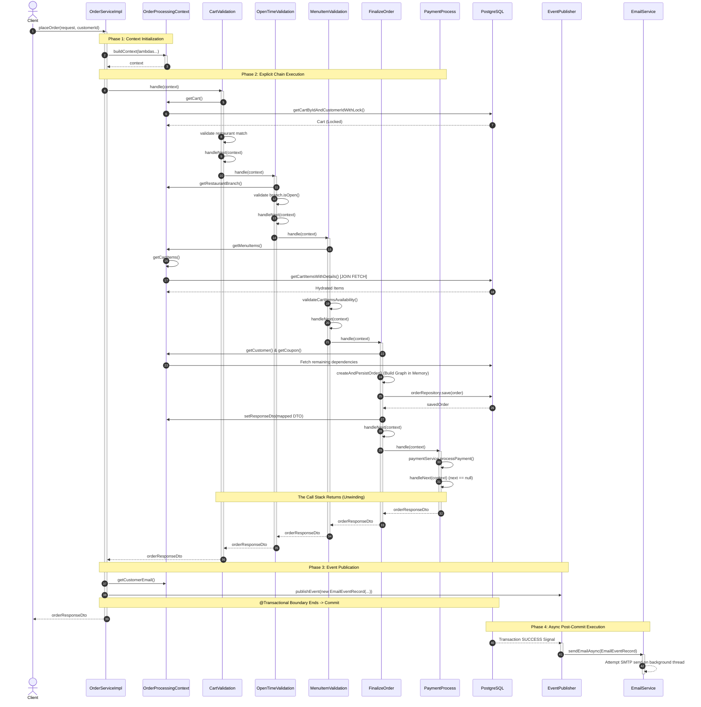
```mermaid
sequenceDiagram
    autonumber
    actor Client
    participant Service as OrderServiceImpl
    participant Context as OrderProcessingContext
    participant H1 as CartValidation
    participant H2 as OpenTimeValidation
    participant H3 as MenuItemValidation
    participant H4 as FinalizeOrder
    participant H5 as PaymentProcess
    participant DB as PostgreSQL
    participant Pub as EventPublisher
    participant Email as EmailService
    Client ->> Service: placeOrder(request, customerId)
    activate Service
    Note over Service, Context: Phase 1: Context Initialization
    Service ->> Context: buildContext(lambdas...)
    activate Context
    Context -->> Service: context
    deactivate Context
    Note over Service, H5: Phase 2: Explicit Chain Execution
    Service ->> H1: handle(context)
    activate H1
%% Handler 1
    H1 ->> Context: getCart()
    Context ->> DB: getCartByIdAndCustomerIdWithLock()
    DB -->> Context: Cart (Locked)
    H1 ->> H1: validate restaurant match
    H1 ->> H1: handleNext(context)
    H1 ->> H2: handle(context)
    activate H2
%% Handler 2
    H2 ->> Context: getRestaurantBranch()
    H2 ->> H2: validate branch.isOpen()
    H2 ->> H2: handleNext(context)
    H2 ->> H3: handle(context)
    activate H3
%% Handler 3
    H3 ->> Context: getMenuItems()
    Context ->> Context: getCartItems()
    Context ->> DB: getCartItemsWithDetails() [JOIN FETCH]
    DB -->> Context: Hydrated Items
    H3 ->> H3: validateCartItemsAvailability()
    H3 ->> H3: handleNext(context)
    H3 ->> H4: handle(context)
    activate H4
%% Handler 4
    H4 ->> Context: getCustomer() & getCoupon()
    Context ->> DB: Fetch remaining dependencies
    H4 ->> H4: createAndPersistOrder() (Build Graph in Memory)
    H4 ->> DB: orderRepository.save(order)
    DB -->> H4: savedOrder
    H4 ->> Context: setResponseDto(mapped DTO)
    H4 ->> H4: handleNext(context)
    H4 ->> H5: handle(context)
    activate H5
%% Handler 5
    H5 ->> H5: paymentService.processPayment()
    H5 ->> H5: handleNext(context) (next == null)
%% The Stack Unwinds
    Note over H1, H5: The Call Stack Returns (Unwinding)
    H5 -->> H4: orderResponseDto
    deactivate H5
    H4 -->> H3: orderResponseDto
    deactivate H4
    H3 -->> H2: orderResponseDto
    deactivate H3
    H2 -->> H1: orderResponseDto
    deactivate H2
    H1 -->> Service: orderResponseDto
    deactivate H1
    Note over Service, Pub: Phase 3: Event Publication
    Service ->> Context: getCustomerEmail()
    Service ->> Pub: publishEvent(new EmailEventRecord(...))
    Note over Service, DB: @Transactional Boundary Ends -> Commit
    Service -->> Client: orderResponseDto
    deactivate Service
    Note over DB, Email: Phase 4: Async Post-Commit Execution
    DB -->> Pub: Transaction SUCCESS Signal
    activate Pub
    Pub ->> Email: sendEmailAsync(EmailEventRecord)
    deactivate Pub
    activate Email
    Email -->> Email: Attempt SMTP send on background thread
    deactivate Email


```

</details>

---

### 6. Customer Management

Provides customer self-service capabilities for managing accounts, addresses, preferred payment methods, and order
tracking.

- **Address Management** — Full CRUD for delivery addresses with a default address designation. Customers can set any
  address as default via a dedicated endpoint.
- **Preferred Payment** — Customers can view and update their preferred payment method (currently COD).
- **Account Deactivation** — Customers can deactivate their own accounts.
- **Order Tracking History** — Timestamped log of all status transitions for a specific order.

### 7. Restaurant Discovery

A public-facing discovery layer that allows unauthenticated users to search and browse the platform.

- **Search Restaurants** — Filter by name and/or category.
- **Top Restaurants** — Returns restaurants sorted by average rating and rating count.
- **Search Menu Items** — PostgreSQL Full Text Search with a vector index on the `menu_items` table. The query first
  filters using the FTS index, then joins related tables via primary key indexes for optimal performance. Results are
  mapped directly to interface-based projections — no entity loading, no in-app transformation.

### 8. Restaurant Ratings

Customers can rate and review restaurants they've ordered from.

- **Create Rating** — Title, rating (1–5), and optional comment.
- **Update Rating** — Partial updates via PATCH.
- **Delete Rating** — Removes the customer's rating for a restaurant.
- **View Ratings** — Lists all ratings for a specific restaurant.

### 9. Admin Management

System administrators can create new admin accounts with specific role assignments (`ROLE_ADMIN`, `ROLE_CUSTOMER`, or
both).

---

## Testing Strategy

### Singleton Testcontainers

All integration tests run against a **real PostgreSQL instance** managed by Testcontainers. We explicitly avoid H2 or
any in-memory database to ensure tests validate real SQL behavior, constraints, and PostgreSQL-specific features (e.g.,
Full Text Search).

The Testcontainers instance follows the **Singleton pattern** — a single PostgreSQL container is started once and shared
across the entire test suite. This eliminates the overhead of spinning up a new container per test class while still
providing a production-grade database.

### Custom Security Mocking (`@WithMockPrincipal`)

We do not use Spring's standard `@WithMockUser`. Instead, a custom `@WithMockPrincipal` annotation paired with a
`WithSecurityContextFactory` injects a fully hydrated `UserPrincipal` object into the test `SecurityContext`. This
ensures that:

- JPA Auditing (`@CreatedBy`, `@LastModifiedBy`) works correctly during tests.
- Role-based access control behaves identically to production.
- The `SecurityContext` contains the actual principal type the application expects.

### Full Round-Trip Assertions

Controller integration tests using `MockMvc` go beyond HTTP status code assertions. After every request, the test *
*queries the database via Repositories** to verify that:

- Entities were created, updated, or deleted as expected.
- Foreign key relationships are correctly established.
- Computed fields (totals, timestamps) have the correct values.

This ensures the entire stack — from HTTP request through security, validation, service logic, and persistence — is
verified in a single test.

### Idempotency & State Verification

For idempotent endpoints (e.g., menu status toggle), we verify correctness through **pure state verification**:

- Capture the entity's `@LastModifiedDate` before the operation.
- Execute the idempotent request.
- Assert that `@LastModifiedDate` did **not** change (proving the early return path was taken).

This approach avoids `@SpyBean`, which can cause `UnsatisfiedDependencyException` and `ApplicationContext` pollution
across test suites.
---

## Performance Testing and & Optimization

### Generated data

- Just enough to enforce our DB to work hard on the execution plan.
 
  | #  | Table                 |       Row Count | Basis                                                                                     |
  |----|-----------------------|----------------:|-------------------------------------------------------------------------------------------|
  | 1  | `system_config`       |               1 | fixed (singleton row)                                                                     |
  | 2  | `category`            |              20 | fixed                                                                                     |
  | 3  | `users`               |         503,000 | fixed — 3,000 admin + 500,000 customer                                                    |
  | 4  | `user_role`           |         503,000 | fixed — 1 per user                                                                        |
  | 5  | `restaurant`          |             300 | fixed                                                                                     |
  | 6  | `restaurant_category` |            ~582 | approx — 1 to 3 categories per restaurant                                                 |
  | 7  | `restaurant_branch`   |             900 | fixed — 3 branches per restaurant                                                         |
  | 8  | `coupon`              |             450 | fixed                                                                                     |
  | 9  | `restaurant_menu`     |           2,700 | fixed — 3 menus per branch                                                                |
  | 10 | `menu_item`           |         148,500 | fixed — 55 items per menu                                                                 |
  | 11 | `customer`            |         500,000 | fixed                                                                                     |
  | 12 | `customer_address`    |      ~1,000,000 | approx — 1 to 3 addresses per customer                                                    |
  | 13 | `cart`                |        ~250,000 | approx — ~50% of customers have an active cart                                            |
  | 14 | `cart_item`           |        ~875,000 | approx — 1 to 6 items per cart                                                            |
  | 15 | `orders`              |       1,300,000 | fixed                                                                                     |
  | 16 | `order_item`          |      ~4,550,000 | approx — 1 to 6 items per order                                                           |
  | 17 | `order_tracking`      |      ~4,615,000 | approx — trail length depends on final order status (1 for PENDING up to 4 for DELIVERED) |
  | 18 | `restaurant_rate`     |         250,000 | fixed                                                                                     |
  |    | **Total**             | **~14,500,000** |                                                                                           |

---

## ER Diagram

<details>
<summary>Modular Diagram</summary>

### Module 1 — User & Auth

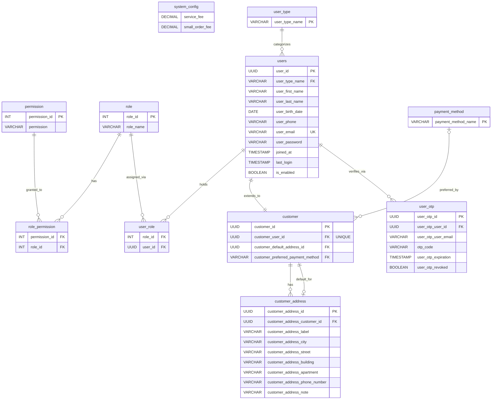
```mermaid
erDiagram
    system_config {
        DECIMAL service_fee
        DECIMAL small_order_fee
    }

    permission {
        INT permission_id PK
        VARCHAR permission
    }

    role {
        INT role_id PK
        VARCHAR role_name
    }

    role_permission {
        INT permission_id FK
        INT role_id FK
    }

    user_type {
        VARCHAR user_type_name PK
    }

    users {
        UUID user_id PK
        VARCHAR user_type_name FK
        VARCHAR user_first_name
        VARCHAR user_last_name
        DATE user_birth_date
        VARCHAR user_phone
        VARCHAR user_email UK
        VARCHAR user_password
        TIMESTAMP joined_at
        TIMESTAMP last_login
        BOOLEAN is_enabled
    }

    user_role {
        INT role_id FK
        UUID user_id FK
    }

    customer {
        UUID customer_id PK
        UUID customer_user_id FK "UNIQUE"
        UUID customer_default_address_id FK
        VARCHAR customer_preferred_payment_method FK
    }

    customer_address {
        UUID customer_address_id PK
        UUID customer_address_customer_id FK
        VARCHAR customer_address_label
        VARCHAR customer_address_city
        VARCHAR customer_address_street
        VARCHAR customer_address_building
        VARCHAR customer_address_apartment
        VARCHAR customer_address_phone_number
        VARCHAR customer_address_note
    }

    user_otp {
        UUID user_otp_id PK
        UUID user_otp_user_id FK
        VARCHAR user_otp_user_email
        VARCHAR otp_code
        TIMESTAMP user_otp_expiration
        BOOLEAN user_otp_revoked
    }

    payment_method {
        VARCHAR payment_method_name PK
    }

    permission ||--o{ role_permission: "granted_to"
    role ||--o{ role_permission: "has"
    user_type ||--o{ users: "categorizes"
    users ||--o{ user_role: "holds"
    role ||--o{ user_role: "assigned_via"
    users ||--|| customer: "extends_to"
    customer ||--o{ customer_address: "has"
    customer_address |o--|| customer: "default_for"
    payment_method |o--o{ customer: "preferred_by"
    users ||--o{ user_otp: "verifies_via"
```

---

### Module 2 — Restaurant

> Audit columns (`created_by`, `modified_by`, `admin_id`) reference `users(user_id)` but are not linked to keep the
> diagram clean.

```mermaid
erDiagram
    restaurant {
        UUID restaurant_id PK
        VARCHAR restaurant_name
        VARCHAR restaurant_description
        BOOLEAN is_deleted
    }

    restaurant_branch {
        UUID branch_id PK
        UUID branch_rest_id FK
        DECIMAL branch_delivery_fee
        DECIMAL branch_min_order
        VARCHAR branch_city
        TIME branch_open_time
        TIME branch_close_time
        VARCHAR branch_phone_number
        INT branch_estimated_delivery_time
        BOOLEAN is_enabled
        BOOLEAN is_deleted
        TIMESTAMP created_at
        TIMESTAMP last_modified
        UUID created_by FK "audit - users"
        UUID modified_by FK "audit - users"
        UUID admin_id FK "audit - users"
    }

    category {
        INT category_id PK
        VARCHAR category_name
    }

    restaurant_category {
        INT category_id FK
        UUID restaurant_id FK
    }

    restaurant_menu {
        UUID restaurant_menu_id PK
        UUID restaurant_menu_rest_branch_id FK
        VARCHAR restaurant_menu_name
        BOOLEAN is_enabled
        BOOLEAN is_deleted
        TIMESTAMP created_at
        TIMESTAMP last_modified
        UUID created_by FK "audit - users"
        UUID modified_by FK "audit - users"
    }

    menu_item {
        UUID menu_item_id PK
        UUID restaurant_menu_id FK
        VARCHAR menu_item_name
        VARCHAR menu_item_description
        DECIMAL menu_item_price
        BOOLEAN is_available
        BOOLEAN is_deleted
        TIMESTAMP created_at
        TIMESTAMP last_modified
        UUID created_by FK "audit - users"
        UUID modified_by FK "audit - users"
    }

    restaurant_rate {
        UUID restaurant_rate_id PK
        UUID restaurant_rate_restaurant_id FK
        UUID restaurant_rate_customer_id FK
        VARCHAR restaurant_rate_title
        INT restaurant_rate_rating
        VARCHAR restaurant_rate_comment
        TIMESTAMP restaurant_rate_created_at
    }

    coupon {
        UUID coupon_id PK
        UUID coupon_restaurant_id FK
        DECIMAL coupon_amount
        TIMESTAMP coupon_available_from
        TIMESTAMP coupon_available_to
        BOOLEAN coupon_is_active
        TIMESTAMP coupon_created_at
        TIMESTAMP coupon_last_modified
    }

    customer {
        UUID customer_id PK
    }

    restaurant ||--o{ restaurant_branch: "operates"
    restaurant ||--o{ restaurant_category: "tagged_with"
    category ||--o{ restaurant_category: "classifies"
    restaurant_branch ||--o{ restaurant_menu: "offers"
    restaurant_menu ||--o{ menu_item: "contains"
    restaurant ||--o{ restaurant_rate: "reviewed_in"
    customer ||--o{ restaurant_rate: "submits"
    restaurant ||--o{ coupon: "provides"
```

---

### Module 3 — Cart

```mermaid
erDiagram
    customer {
        UUID customer_id PK
    }

    restaurant_branch {
        UUID branch_id PK
    }

    menu_item {
        UUID menu_item_id PK
    }

    cart {
        UUID cart_id PK
        UUID cart_customer_id FK
        BOOLEAN is_locked
        UUID cart_current_rest_id FK
    }

    cart_item {
        BIGINT cart_item_id PK
        UUID cart_item_cart_id FK
        UUID menu_item_id FK
        INT cart_item_quantity
        VARCHAR cart_item_note
    }

    customer ||--o| cart: "owns"
    restaurant_branch |o--o| cart: "selected_in"
    cart ||--o{ cart_item: "holds"
    menu_item ||--o{ cart_item: "added_as"
```

---

### Module 4 — Order

```mermaid
erDiagram
    customer {
        UUID customer_id PK
    }

    restaurant_branch {
        UUID branch_id PK
    }

    menu_item {
        UUID menu_item_id PK
    }

    coupon {
        UUID coupon_id PK
    }

    order_status {
        VARCHAR order_status PK
    }

    orders {
        UUID order_id PK
        VARCHAR order_delivery_city
        VARCHAR order_delivery_street
        VARCHAR order_delivery_building
        VARCHAR order_delivery_apartment
        VARCHAR order_delivery_phone_number
        VARCHAR order_delivery_note
        UUID order_customer_id FK
        UUID order_restaurant_branch_id FK
        UUID order_coupon_id FK
        DECIMAL order_discount_value
        DECIMAL order_subtotal
        DECIMAL order_fee
        DECIMAL order_total
        TIMESTAMP order_date
        VARCHAR order_note
        VARCHAR order_status FK
    }

    order_item {
        UUID order_item_id PK
        UUID order_item_order_id FK
        UUID order_item_menu_item_id FK
        DECIMAL order_item_unit_price
        INT order_item_quantity
        DECIMAL order_item_subtotal
        VARCHAR order_item_note
    }

    order_tracking {
        UUID order_tracking_id PK
        VARCHAR order_tracking_status FK
        UUID order_tracking_order_id FK
        VARCHAR order_tracking_description
        TIMESTAMP order_tracking_created_at
    }

    customer ||--o{ orders: "places"
    restaurant_branch ||--o{ orders: "fulfills"
    coupon |o--o{ orders: "discounts"
    order_status ||--o{ orders: "describes"
    orders ||--o{ order_item: "includes"
    menu_item ||--o{ order_item: "ordered_in"
    orders ||--o{ order_tracking: "tracked_via"
    order_status ||--o{ order_tracking: "logs"
```

---

### Module 5 — Payment

```mermaid
erDiagram
    orders {
        UUID order_id PK
    }

    customer {
        UUID customer_id PK
    }

    restaurant_branch {
        UUID branch_id PK
    }

    payment_provider {
        VARCHAR payment_provider_name PK
    }

    payment_method {
        VARCHAR payment_method_name PK
    }

    payment_provider_config {
        INT payment_provider_config_id PK
        VARCHAR payment_provider_name FK
        TEXT config_details
    }

    transaction_status {
        VARCHAR status PK
    }

    transactions {
        UUID transaction_id PK
        VARCHAR transaction_status FK
        UUID transaction_order_id FK
        VARCHAR transaction_payment_provider FK
        UUID transaction_customer_id FK
        UUID transaction_rest_branch_id FK
        VARCHAR transaction_payment_method FK
        DECIMAL transaction_amount
        TIMESTAMP transaction_time
    }

    payment_provider ||--o{ payment_provider_config: "configured_with"
    transaction_status ||--o{ transactions: "has"
    orders ||--o{ transactions: "settled_via"
    payment_provider ||--o{ transactions: "processed_by"
    customer ||--o{ transactions: "pays"
    restaurant_branch ||--o{ transactions: "receives_via"
    payment_method ||--o{ transactions: "used_in"
```

</details>
 
